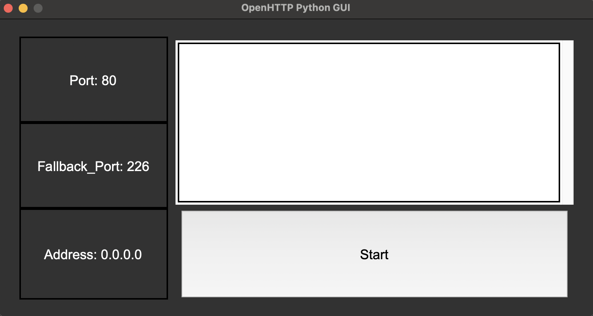

# OpenHTTP
OpenHTTP is an open source HTTP web server made by Cameron McLaughlin between September 10th 2025 and October 30th 2025

[Click this to skip all the technical mumbo jumbo](#how-to-actually-use-it).

## 1.0 Features
Currently, OpenHTTP can receive `GET` and `HEAD` requests and respond to them, along with being able to turn a file path into a MIME type (e.g "www/index.html" -> "text/html"). The MIME conversion uses [the official Mozilla "Common Media Types" page](https://developer.mozilla.org/en-US/docs/Web/HTTP/Guides/MIME_types/Common_types). OpenHTTP also has proper 404 and 206 handling for the `Range: butes=min-max` request header.

## 1.1 Limitations
Unfortunately, OpenHTTP is still in the early stages of devlopment, so many features included by other web servers (such as Apache) are not compatible with OpenHTTP (unsupported requests are met with a 500 for now). The <ins>only</ins> requests that OpenHTTP can interpret and respond to are `GET` and `HEAD` requests, meaning that `POST` requests are unsupported. It also very rarely hangs for no reason.

## 1.2 Speed
OpenHTTP has been benchmarked with the "Siege" HTTP load tester (`brew install siege`). Below are the results when tested with 10 concurrent clients and every directory from [this example project](https://github.com/i-hate-swift-so-much/yeezify.git) file path and using the -i command line argument.
```
Transactions: 6862 hits
Availability: 100.00 %
Elapsed time: 60.61 secs
Data transferred: 40733.49 MB
Response time: 88.14 ms
Transaction rate: 113.22 trans/sec
Throughput: 672.06 MB/sec
Concurrency: 9.98
Successful transactions: 6862
Failed transactions: 0
Longest transaction: 370.00 ms
Shortest transaction: 0.00 ms
```
The results will vary depending on the server hardware, as this was executed on my local host.

## 1.3 Future plans
### 1.3.0 Confirmed Plans
For the future, plans which I will be doing are as follows:
* POST Request Support

### 1.3.1 Possible Plans
For the future, plans which I am considering doing are as follows:
* HTTPS support
* Windows support

## 1.4 Under the hood
OpenHTTP is multithreaded, meaning that everytime a request is sent to the server and succesfully connects, a new thread is started on
the CPU to handle the request. Once the server begins to handle a request, it parses the request into an 
`std::map<std::string, std::string>` (for javascript skids, this is equivalent to an object) to seperate the header into key value pairs
for future use (e.g. `"Range: bytes=0-100"` turns into `std::pair<std::string, std::string> whatever = {"Range":"bytes=0-100"};`.
Again, for the javascript skids this is equivalent to `var whatever = {"Range":"bytes=0-100"};`), after this is processes the map by
fetching the file (either using `std::string FetchResource(std::string path)` or `std::vector<unsigned char>
FetchResourceRanged(std::string path, std::streamoff begin, std::streamoff end)` depending on the existence of `Range` in the request header, then its finally ready to send!

## 1.5 How to actually use it
Just put the HTML/JS/CSS files into `www/`, check that its runnning on the right port and IP, then run `./main/sh` to recompile and run the program.

---

# 2.0 Camfig
In the OpenHTTP directory, there is a file named `.camfig`, this file is used as a configuration file similar to how Apache uses the `.conf` extension. The reason I made my own file is because I'm lazy and didn't want to learn the syntax of another config file format, and I wanted the syntax to be simple.

## 2.1 Camfig syntax
To start, camfig is **CASE SENSITIVE**, meaning that each property must match its example if any examples exist.

### 2.1.0 Basic syntax
Camfig uses a very basic syntax in which there is a key and value (always seperated by a colon) for each property. For example, the property `Address:Any` has a key of `Address` and a value of `Any` (this specific property tells the server to use all network interfaces for serving).

### 2.1.1 Comments
Comments in camfig are basically just shell script comments in the sense that they use the "#" character to begin a comment and continue until the next line, the only difference is that they can only be single lines (no comment blocks).

---

# 3.0 GUI
Written in Python, the GUI is a very minimal alternative to running the program directly.

## 3.1 GUI Layout

The layout of the OpenHTTP GUI is simple. The three text boxes which span from the top left to bottom left corner of the window dispay three properties defined in your camfig, the Port property, the Fallback_Port property, and the Address property in that order. In the top right, there is a text box with a scroll bar that shows the std::out of the server. In the bottom right, there is a button that when pressed, will either start or stop the server.

## 3.2 Using the GUI
After you compile the program, you will be able to use the GUI through two shell scripts depending on which architecture you compiled for. If you compiled the server as an arm64 program (e.g. Newer Macs, Raspberry PIs), you can run the GUI with the command `arm64gui.sh`. Similarly, if you compiled the server as an x86_64 program (e.g. a Linux Server using an Intel/AMD CPU), you can run the GUI with the command `x86_64gui.sh`.

## 3.3 How it works
The OpenHTTP GUI uses python with the built in tkinter library for easy cross compatibility with the trade off being slower performance. The GUI is also very lightweight (for a python program, at least). Along with the GUI, I have implemented a Camfig parsed (`UI/Camfig.py`) for anyone who wants to tinker with it, but also so I could get the Port, Address, and Fallback_Port values.

---

# 4.0 Known Errors
## 4.1 GUI.
* The GUI sometimes fails to cancel the OpenHTTP process when the window is closed, if it does this, the fix is to quit the process from your systems task manager.

---

Please report any errors you find in the `issues` forum on this github repo, including the request that was sent to the server before the crash (seen in Request_Log) and any error messages generated in the terminal. If you dont have these, just describe what you were doing in detail.